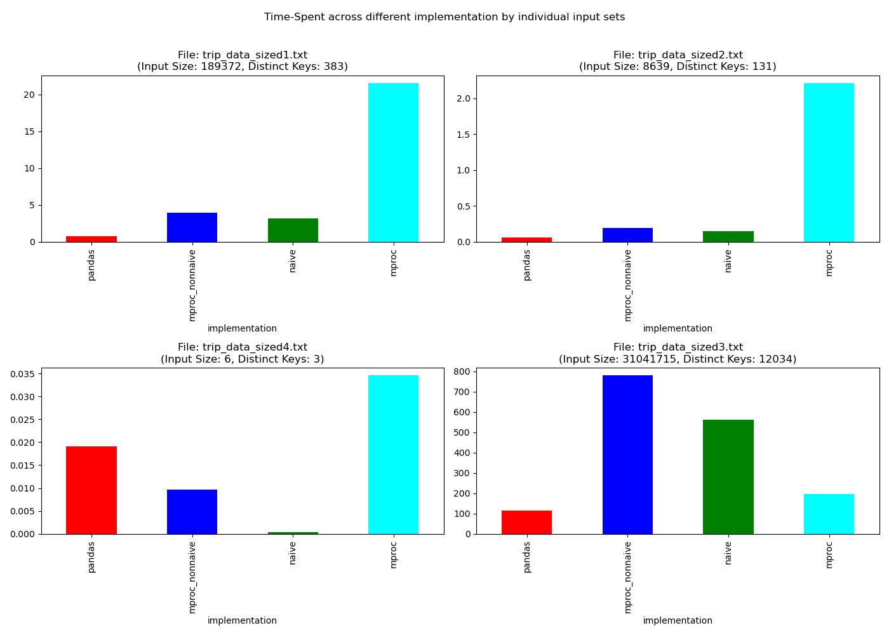

# Drivers Activities Reporting
-------
[](https://www.python.org/)


## Problem Statement (Brief):

For a given input file containing driver activities, generate a report comprised of each drivers' total miles driven and the average speed, both of which are rounded to the nearest integer. Additionally, the output needs to be sorted by the most miles driven to the least. [Reference](#https://gist.github.com/dan-manges/1e1854d0704cb9132b74).

### Example input:

```
Driver Dan
Driver Lauren
Driver Kumi
Trip Dan 07:15 07:45 17.3
Trip Dan 06:12 06:32 21.8
Trip Lauren 12:01 13:16 42.0
```

### Expected output:

```
Lauren: 42 miles @ 34 mph
Dan: 39 miles @ 47 mph
Kumi: 0 miles
```

## Solution Approaches:

From the problem statement, several assumptions can be levied, <ins>the most important of which are enumerated below</ins>:

```
(A) The design of the solution can be as a scalable, dynamic key/value store, wherein, the keys are guaranteed to be a simple data structure (string).
(B) The designed solution has to support frequent updates to the values of the keys.
(C) Reported average speed across activities is mean of the speed taken at once,
    rather than building up incremental mean (in an online fashion). This assumption is built from the understanding of the supplied output for Dan.
(D) While the solution gaurantees that end_time >= start_time, my solution is able
    to handle scenarios where end_time < start_time (i.e., trip ended on the following day).
```

<i> <u> I have designed three different solutions for the purpose of this evaluation, which are as follows: </i> </u>

### Solution-1:

<b>Reference File:</b> `naive_implementation.py`<br/>
<b>Data Structures Used:</b> `Counter, mmap constructor`

#### Discussions:

The attraction of this implementation is that it leverages `mmap` for optimized I/O using memory mapping and uses the subclass of dict called Counter with a unique key identifier (driver id) as the hashable object. The file is read line by line and using the most_common() method of the counter, it follows a neat approach to produce a sorted report with a constant lookup of O(1). The file is read line by line to maintain a constant space solution, rather than loading the entire file in memory at the cost of additional space. The time difference between the former and the latter in the presence of `mmap` is negligibly smaller, thereby casting the present arrangement as an optimal solution.

### Solution-2 (Improvement over Solution-1):

<b>Reference File:</b> `multiprocessing_implementation.py, multiprocessing_implementation_shelve.py` <br/>
<b>Data Structures Used:</b> `Counter, Shelve, mmap constructor
Compute Paradign: Multiprocessing`

As the input is just a single file instead of a large number of files, one quick drawback of Solution-1 for a large file, is that we spend a significant time reading the file (while maintaining constant space solution), which drains the CPU resources. An efficient improvement will be to utilize the available CPU cores to distribute the file read and data-wrangling across a set of worker nodes to reap the advantages arising from parallelization. An additional drawback of solution-1 is that if the number of keys (unique driver identifiers) becomes exceedingly large, Solution-1 suffers heavily and may even fall short of the available memory. This is not just in the case of a large number of keys, but also for memory-deficient systems that may not be able to support such an application.

Herein, I have presented two distinct solutions, each of which leverage python's multiprocessing package to fully leverage the available cores in the host system. While multiprocessing_implementation.py implementation continues to use the subclass of dict, Counter() as its preferred data structure for holding the keys generated by the worker nodes, multiprocessing_implementation_shelve.py makes use of a persistent, in-memory dictionary-like object called shelve as its choice of dynamic key/value store. While shelve is slower than the native Counter() implementation in general, it makes it possible for the application to support a huge amount of keys or deployment on small memory systems by holding datasets larger than the memory. Another candidate that was under consideration was [Chest](#https://github.com/blaze/chest) that has support for all hashable key and competitive file-saving schemes. However, since our key continues to be 'string' all-time the, shelve which is a native solution fits the bill.

On another note, I was tempted to evaluate the idea of using open-source dynamic key-value stores like Etcd, Zookeeper, Redis, etc. Or, a full-fledged open-source key/value DBs like BerkeleyDB, etc. that would support efficient handling of the disk-space. However, given our requirement of a single file-read, imbibing complexities arising out of distributed technologies and their inherent tradeoffs was surely beyond our affordability from the requisite application. On the compute paradigm end, beyond subprocess based multiprocessing architecture, I was also evaluating solutions making use of MPI programming or map-reduce, that may have been suitable should we required a distributed application. But, given the current problem statement relying on a single file as input, multiprocessing was an optimal design choice for constant space implementations.

### Solution-3 (Using Pandas):

<b>Reference File:</b> `pandas_implementation.py`

Another simplified implementation (and, more often, a practical design choice) would be to make use of a mature, enterprise-grade data manipulation tool like Pandas that offers tremendous power, pace, the flexibility of handling complex inputs, data structures at scale, alongside the benefits arising from the enormous ecosystem of pandas. Another, natively scalable Python solution in [Dask](#https://dask.org/) was also under consideration, however, given the strength of Dask in distributed compute, I ruled it out early in my consideration. The implemented solution in pandas makes use of basic pandas data structure to support flexible, at-scale reporting. Additionally, the implemented solution acted as a baseline for my custom solutions using multiprocessing and/or shelve and naive solution to validate the output generating using other implementations. Please refer to the test folder and/or validate_results to understand the usage of pandas as a baseline.


### General Notes:

There are several other essential system design considerations both within the purview of Distributed Systems (DS) and outside such as supporting strong consistency, high-availability of the systems and flexibility, extensibility of the data structure in building a robust dynamic key/value store, which was at the top of my mind in pitching my implemented solutions. Such considerations may form a stronger motivation in increased interest with systems like Dynamodb, Redis (through its external key-value shell for building secondary indexes), etc. DS properties like strong consistency, high-availability are best tackled at the system design layer over the application layer for it brings tremendous flexibility in migrating to new systems or updates to the existing systems or in general considerations around system scalability.

Additionally, my implementations were motivated from a client-server architecture standpoint (serving through REST/GraphQL server) with fundamental characteristics like latency, throughput. I was also exploring the idea of using encryption with the dictionary keys like substitution cipher algorithms, etc. however, I descoped the idea of encrypting the dictionary keys owing to the overhead it would bring along.

Furthermore, I have made one moderately strong assumption about the input file in that, presently, the generated report doesn't make any consideration around the ordering of 'Driver *' and 'Trip *' lines. One specific business use case might be to discard all such drivers out of the report who have never been registered (marked with: Driver driver_id) [Business_Rule-1] or to exclude those drivers completely whose some/all activities preceded their registration [Business_Rule-2]. For example, the following three file data arrangement should make that particular driver ('Kumi' in this case) from appearing in the report, or to exclude driver activities that preceded their registration:

#### Format 1:
```
Trip Kumi 07:15 07:45 17.3
Trip Kumi 06:12 06:32 21.8
Driver Kumi
```

Reason for exclusion: Kumi's trip activities preceded her registration (that was done in the third line) in the file.

#### Format 2:
```
Trip Kumi 07:15 07:45 17.3
Trip Kumi 06:12 06:32 21.8
```
Reason for exclusion: Kumi was never registered (using Driver <driver_id>)

#### Format 3:
```
Trip Kumi 07:15 07:45 17.3
Trip Kumi 06:12 06:32 21.8
Driver Kumi
Trip Kumi 12:15 13:45 17.3
Trip Kumi 15:12 15:32 21.8

```
<b>N.B. : </b>Reason for partial-exclusion: Line numbered 1, 2 were excluded because they preceeded Kumi's registration.

#### Possible Implementation:

In naive_implementation.py and pandas_implementation.py file, including such business rules is pretty-straightforward in that the aggregation skips any unregistered driver activity and starts considering them only after they are registered (Business_Rule-2). As such, the implementation will add no computational (time, space) overhead to the existing implementation. For the multiprocessing implementation, incorporating both Business_Rule-1 and Business_Rule-2 will be non-naive, because the files are parallelly processed in splits. For scenarios, where driver registration was made in one chunk (say, split-1) and activities of that driver was processed by another chunk (say, split-2), Business_Rule-1 may be implemented by maintaining an additional list (extra space requirements) containing registered drivers extracted from the individual chunks or another method may be to start the dictionary from -1 instead of 0 and accounting for the negative count when the first activity is encounter. For accomodating Business_Rule-2, however, we have to either ensure ordered chunks or spend a lightweight overhead in pre-marking those activities that violate Business_Rule-2 for the partial exclusion with ordered processing.

### Side-by-side comparison of the implementations:


<center><b> Figure 1: Side-by-side comparison of different implementation</b></center>

```
Legends:
pandas: pandas_implementation.py
mproc_nonnaive: multiprocessing_implementation.py
mproc: multiprocessing_implementation_shelve.py
naive: naive_implementation.py
```
From Figure 1 above, we can see several interesting patterns emerging: For smaller datasets (as in `trip_data_sized4.txt`), `naive` and multiprocessing without shelve, `mproc_nonnaive` implementations, outperform both `pandas` and `mproc_nonnaive`. For medium-sized datasets, though `pandas` outperform both `naive` and `mproc_nonnaive` implementations, both of these individual implementations are not far behind and have very similar performances. Multiprocessing with shelve (`mproc`) fails to impress us much and that's expected given the bigger purpose it's designed for. For large datasets (like, `trip_data_sized3.txt`), `mproc` implementation starts to better its candidature over both `naive` and `mproc_nonnaive` implementations and has near similar performance to `pandas`. Both non-naive and multiprocessing without shelve implementations, seem to suffer heavily from the explosion of the huge number of keys with larger files. For even bigger datasets, `mproc` is expected to outperform both naive and mproc_nonnaive implementations. Such empirical findings correlate with our initial design concerns and elegantly fit in the large scheme of things.

### Setup

- Python 3 (>=3.5)
- Create an appropriate environment (if deemed suitable)
```bash
conda create -n <env_name> python=<python_env>
ex: conda create -n test_root python=3.7.9
```
- Install the required packages
```bash
pip install requirements.txt
```
- To Run the test folder, navigate to ```bash /src/test ``` folder, and run any of the `test_*.py` files as ```bash python test_*.py```
- To Run the actual code files directly from command line, run:
```bash
python <file_name.py> -i <input_dir> -o <output_dir>
ex:
python naive_implementation.py -i trip_data_sized4.txt
or
python naive_implementation.py -i ../input/trip_data_sized4.txt -o ../output/custom_output_file.txt
```

### Project Structure
```
project_name
   +-- README.md
   +-- setup.py
   +-- requirements.txt
   +-- src
   |   +-- input
   |   +-- main
   |   +-- expected_output
   |   +-- output
   |   +-- resources
   |   +-- analytics
   |   +-- test
   |   +-- log
 ```

N.B: The following folders are generated at runtime: `log`, `output`, `resources`. Another working directory `tmp` is generated, destroyed at runtime.

#### Estimated Developmental Effort:

```
Development: 2.5-3 hours
Testing: 1.5-2 hours
Other Logistics (Formatting, Commenting, Documentation): 3-3.5 hours
```

#### Thank you Note

Thank you for your effort, time in reading the Readme file, and thereby my other code segments. Should you have suggestions/advice on anything about the code piece, please do reach out ([Email Aditya](#mailto:akroy@umass.edu)).

Additionally, as this submission is geared towards creating an opportunity to interview at Root, I look forward to hearing back from the company.

Github Repo: [@royadityak94](#https://github.com/royadityak94), [@royadityak](#https://github.com/royadityak)
Personal Webpage: [Web](#https://sites.google.com/view/adityakumarroy)
